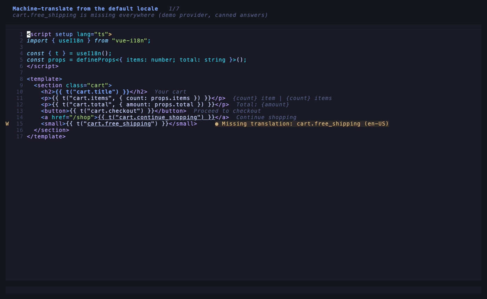
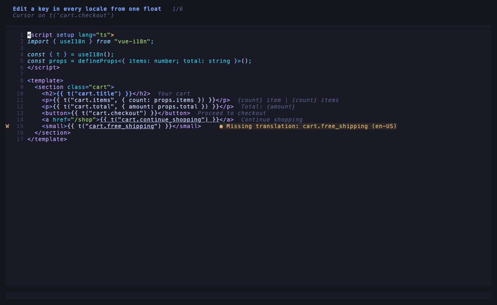
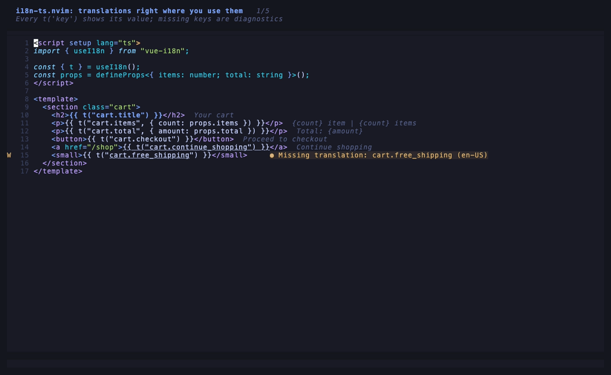
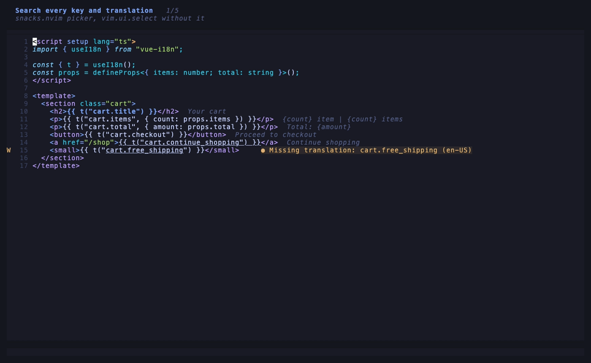
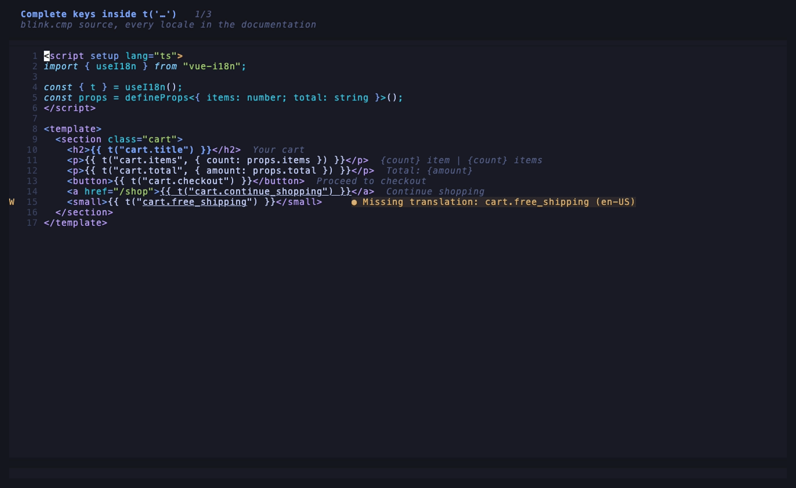

# i18n-ts.nvim

See your translations where you use them. A fast, dependency-free Neovim plugin for TypeScript / JavaScript projects using JSON translation files: vue-i18n, i18next / react-i18next, next-intl, nuxt-i18n, or your own `t()`.

**Machine-translate from the default locale.** Type the `en-US` value, save and close: every other locale is filled in the background. `gT` re-translates them all after you change the source text. The GIF uses a demo provider with canned answers.



**Edit a key in every locale from one float.** One line per locale, badges for modified and missing values, the keys listed below.



**Translations next to every `t()` call.** Missing keys as diagnostics, switch the displayed locale, see every locale, go to definition.



**Search every key and translation.** File preview, jump to the definition, remove a key from every locale.



**Complete keys inside `t('…')`.** With blink.cmp, every locale in the documentation.



## Features

- Translation shown next to every `t('key')`, `$t("key")`, `i18n.global.t(...)` call, for the visible lines only
- Diagnostics for keys missing in the default locale (optionally in every locale)
- Go to definition: jump from a key to its exact line in the translation file
- Float with the key in every locale, and a command to switch the displayed locale
- Completion of keys inside `t('…')` with [blink.cmp](https://github.com/Saghen/blink.cmp), all locales in the documentation
- Picker over every key and translation ([snacks.nvim](https://github.com/folke/snacks.nvim), `vim.ui.select` without it)
- Edit a key in every locale from one float: one line per locale, the default locale first, `:w` to save
- Machine-translate the empty locales from the default one (Claude Code with no API key, the Claude API, DeepL, your own command or Lua function)
- Add a key to every locale file at once, keeping key order and indentation
- Remove a key from every locale file, with a warning when the code still uses it
- Find the usages of a key with ripgrep
- Zero config for the usual layouts: the project root and the translation files are detected

Large projects stay fast: loading 13 locales of ~2,900 keys takes under 100 ms, and rendering a buffer under 1 ms. Translation files are indexed in a single pass, and locales other than the default one load in the background.

## Requirements

- Neovim >= 0.10
- Optional: [ripgrep](https://github.com/BurntSushi/ripgrep) for `:I18n usages`
- Optional: `curl` (7.84+ for `retry-after` handling) for the Claude and DeepL translation providers
- Optional: snacks.nvim (pickers), blink.cmp (completion)

## Installation

<details open>
<summary><b>LazyVim / lazy.nvim</b></summary>

`lua/plugins/i18n-ts.lua`:

```lua
return {
  {
    "Antoine-Regembal/i18n-ts.nvim",
    version = "*", -- releases only, not every commit on main
    event = { "BufReadPre", "BufNewFile" },
    opts = {
      -- Machine translation is off by default, see "Machine translation" to pick a provider:
      -- translate = { provider = "claude_code" },
    },
    keys = {
      { "<leader>Ie", "<cmd>I18n edit<cr>", desc = "Edit key (all locales)" },
      { "<leader>Is", "<cmd>I18n show<cr>", desc = "Show key in all locales" },
      { "<leader>Ik", "<cmd>I18n keys<cr>", desc = "Search keys" },
      { "<leader>Id", "<cmd>I18n def<cr>", desc = "Go to key definition" },
      { "<leader>In", "<cmd>I18n next<cr>", desc = "Next displayed locale" },
      { "<leader>IT", "<cmd>I18n translate<cr>", desc = "Translate missing locales" },
      { "<leader>IR", "<cmd>I18n retranslate<cr>", desc = "Re-translate all locales" },
      { "<leader>Ia", "<cmd>I18n add<cr>", desc = "Add key" },
      { "<leader>Ix", "<cmd>I18n remove<cr>", desc = "Remove key" },
      { "<leader>Iu", "<cmd>I18n usages<cr>", desc = "Key usages" },
      { "<leader>It", "<cmd>I18n toggle<cr>", desc = "Toggle translations" },
      { "<leader>Ii", "<cmd>I18n info<cr>", desc = "i18n info" },
    },
  },

  -- Key completion inside t('…'), every locale in the documentation
  {
    "saghen/blink.cmp",
    optional = true,
    opts = {
      sources = {
        default = { "i18n" },
        providers = { i18n = { name = "i18n", module = "i18n-ts.blink" } },
      },
    },
  },

  -- "i18n" label for the <leader>I group
  {
    "folke/which-key.nvim",
    optional = true,
    opts = {
      spec = { { "<leader>I", group = "i18n" } },
    },
  },
}
```

- **The blink.cmp and which-key.nvim blocks are optional extras.** Both plugins ship with LazyVim. `optional = true` means each block only applies when that plugin is installed, so leave both blocks in either way. LazyVim merges `sources.default` with its own list, so `lsp`, `path` and the others stay enabled.
- **`<leader>I` is a suggestion;** any prefix works. linear.nvim, for example, uses `<leader>i`.
- **Why no `gd` by default:** LazyVim sets `gd` for the language server when it attaches to a buffer, after the plugin's keys, so a plugin `gd` would be overridden. To make `gd` jump to the key under the cursor and fall back to the LSP elsewhere, add this to the first spec:

  ```lua
  init = function()
    vim.api.nvim_create_autocmd("LspAttach", {
      callback = function(args)
        -- Scheduled so it runs after LazyVim's own LspAttach mappings
        vim.schedule(function()
          if not vim.api.nvim_buf_is_valid(args.buf) then
            return
          end
          vim.keymap.set("n", "gd", function()
            if not require("i18n-ts").definition() then
              vim.lsp.buf.definition()
            end
          end, { buffer = args.buf, desc = "Go to definition (i18n key or LSP)" })
        end)
      end,
    })
  end,
  ```

</details>

<details>
<summary><b>Any other plugin manager</b></summary>

Add `Antoine-Regembal/i18n-ts.nvim` to your runtime path (pin the latest tag, e.g. `v0.1.0`), and call:

```lua
require("i18n-ts").setup({})
vim.keymap.set("n", "<leader>Ie", "<cmd>I18n edit<cr>", { desc = "Edit key (all locales)" })
-- … the other :I18n commands, see "Commands"
```

With blink.cmp, add the completion source to your blink config: `providers = { i18n = { name = "i18n", module = "i18n-ts.blink" } }`, and `"i18n"` in `sources.default`. which-key is not needed; it only labels the key group.

</details>

Run `:checkhealth i18n-ts` from a source file to see the detected root, translation files, locales and key count.

## How the project is found

1. **Root.** The first of `root_markers` found upwards from the buffer: `.i18n-ts.json`, then `.git`, then `package.json`. In a monorepo the git root wins, so the translation files of every package are found from any file.
2. **Translation files.** Use `sources` when set. Otherwise the plugin looks for directories named `locales`, `locale`, `i18n`, `lang`, `langs`, `messages` or `translations`, up to 4 levels deep, skipping `node_modules`, `dist`, `build` and hidden directories:
   - `<dir>/en.json`, `<dir>/fr.json`, … gives `<dir>/{locale}.json`;
   - `<dir>/en/common.json`, … gives `<dir>/{locale}/{namespace}.json`.
3. **Locales.** Use `locales` when set. Otherwise every locale found, sorted. The default locale is always listed first.
4. **Default locale.** `default_locale` (default `"en-US"`) is matched leniently: case and `_`/`-` are ignored (`en_US.json` matches), then the base language (`en`), then any locale of that language (`en-GB`), then the first locale. A project with only `en.json` still gets `en`.

## Configuration

Defaults:

```lua
require("i18n-ts").setup({
  root_markers = { ".i18n-ts.json", ".git", "package.json" },
  -- Relative to the root. `{locale}` is required, `{namespace}` optional. Empty: auto-detected.
  sources = {},
  -- Empty: every locale found. The default locale always comes first.
  locales = {},
  -- Source of machine translations; matched leniently (see above).
  default_locale = "en-US",
  -- Keys of `{namespace}` files become `<namespace><separator><key>`.
  namespace_separator = ".",
  -- Namespace tried for keys written without one (i18next `defaultNS`).
  default_namespace = nil,
  -- Call names, matched after any non-identifier character: `i18n.global.t(` and `this.$t(` work.
  functions = { "t", "$t", "tc", "te", "tm" },
  -- Extra Lua patterns capturing the key, e.g. { 'i18nKey="([^"]+)"' }.
  patterns = {},
  filetypes = { "vue", "typescript", "javascript", "typescriptreact", "javascriptreact", "svelte" },
  display = {
    mode = "eol", -- "eol", "inline" (right after the call) or "off"
    max_len = 60,
    prefix = " ",
  },
  diagnostics = {
    enabled = true,
    severity = vim.diagnostic.severity.WARN,
    all_locales = false, -- also hint keys missing in the other locales
  },
  auto_detect = {
    depth = 4,
    dir_names = { "locales", "locale", "i18n", "lang", "langs", "messages", "translations" },
    skip = { "node_modules", "dist", "build", "coverage", "vendor" },
  },
  add = {
    prompt = "all", -- "all": ask a value per locale; "default": reuse the default locale's value
    format_cmd = nil, -- e.g. { "npx", "prettier", "--write" }, run on the written files
  },
  editor = {
    -- Keys of the :I18n edit float: a string, a list, or false to disable
    keys = {
      save_close = "<CR>",
      close = { "q", "<Esc>" },
      next = "<Tab>",
      prev = "<S-Tab>",
      clear = "dd",
      help = "?",
      translate = "<C-t>",
      retranslate = "gT",
    },
  },
  remove = {
    prune_empty = true, -- also delete parent objects left empty
  },
  translate = {
    provider = nil, -- nil (off), "claude_code", "anthropic", "deepl", "command", or function(request, callback)
    auto = true, -- translate the empty locales when the editor float is closed
    context = nil, -- extra hint for the model, e.g. "Medical software used by doctors."
    claude_code = { -- see "Machine translation" for every option
      cmd = "claude",
      model = "claude-haiku-4-5",
      session = true,
      prewarm = true,
      max_turns = 20,
      idle_timeout_ms = 600000,
      request_timeout_ms = 60000,
      max_budget_usd = 0.50,
      extra_args = {},
    },
    anthropic = {
      model = "claude-haiku-4-5",
      api_key_env = "ANTHROPIC_API_KEY",
      base_url = "https://api.anthropic.com",
      max_tokens = 2048,
    },
    deepl = { api_key_env = "DEEPL_API_KEY" },
    command = nil, -- argv, see "Machine translation"
    retry_delay_ms = 2000,
  },
  -- Overrides per project root, from your own config.
  projects = {},
  debounce_ms = 80,
})
```

Configuration is merged in this order: defaults, then `setup()`, then the project's `.i18n-ts.json`, then `setup().projects[root]`. Lists replace lists instead of merging.

### Per-project configuration

Commit a `.i18n-ts.json` at the project root so everyone on the team gets the same setup:

```json
{
  "sources": ["packages/i18n/messages/{locale}.json"],
  "functions": ["t", "$t", "te"]
}
```

It may set `sources`, `locales`, `default_locale`, `namespace_separator`, `default_namespace`, `functions` and `patterns`. The file is read as plain JSON, never executed. Settings that run commands or send data out (`add.format_cmd`, `translate`) are ignored there: set them in your own config, globally or under `projects`.

To keep a configuration to yourself:

```lua
opts = {
  projects = {
    ["~/Code/my-app"] = { locales = { "en", "fr" }, add = { format_cmd = { "pnpm", "exec", "prettier", "--write" } } },
  },
}
```

### Examples

**vue-i18n** with `src/locales/en.json`: no configuration needed.

**i18next / react-i18next** with `public/locales/en/common.json`, keys written `t('common:title')` or `t('title')`:

```json
{ "namespace_separator": ":", "default_namespace": "common" }
```

**next-intl** with `messages/en.json`: no configuration needed. `useTranslations('Home')` scopes are not resolved yet, so write the full key or rely on diagnostics only for full keys.

**Monorepo** with the translations in a shared package:

```json
{ "sources": ["packages/i18n/messages/{locale}.json"] }
```

## Commands

| Command | Action |
| --- | --- |
| `:I18n` / `:I18n info` | Root, sources, locales, key count, load errors |
| `:I18n def` | Jump to the key under the cursor in the displayed locale |
| `:I18n show` | Float with the key in every locale |
| `:I18n next` | Display the next locale |
| `:I18n keys` | Picker: `<CR>` jumps, `<C-e>` edits, `<C-x>` removes, `<C-y>` yanks the key, `<A-i>` inserts it |
| `:I18n edit [key]` | Edit the key in every locale (see below); also works on a key line inside a translation file |
| `:I18n translate [key]` | Machine-translate the key's missing locales from the default locale (inside the editor float: save, then translate now) |
| `:I18n retranslate [key]` | Re-translate every locale of the key from the default one, replacing existing values, after confirmation |
| `:I18n add [key]` | Add the key (argument, or the one under the cursor) to every locale |
| `:I18n remove [key]` | Delete the key (or a whole object) from every locale, after confirmation; warns when the code still uses it |
| `:I18n usages [key]` | Usages of the key, translation files excluded |
| `:I18n toggle` | Hide / show translations and diagnostics |
| `:I18n reload` | Forget every project and re-read the configuration and files |

### Editing translations

`:I18n edit` opens a float with one line per locale, the default locale first:

```
╭──────── i18n  common.actions.save ⠋ translating 1 locale ─────────╮
│ ★ en-US │ Save   source                                           │
│   de    │    ⠋ translating…                                       │
│   es    │    ○ missing                                            │
│   fr    │ Enregistrer les modifications   ● modified              │
│───────────────────────────────────────────────────────────────────│
│ :w     save               <C-t>  translate empty                  │
│ <CR>   save & close       gT     re-translate all                 │
│ <Tab>  next locale        dd     clear value                      │
│ q      close              ?      hide help                        │
╰──── 1 missing · 1 modified · Claude Code, claude-haiku-4-5 ───────╯
```

The default locale is marked `★ … source`. Each line shows its state: `○ missing`, `● modified` (changed, not saved yet), `○ emptied, kept on save`, or `⠋ translating…`. The footer sums it up, with the translation provider, and the legend lists the keys. `?` hides the legend for a compact float, and shows it again. The legend leaves out the translation keys when no provider is set.

Each line holds only the value: the locale label isn't text you can edit. The float keeps exactly one line per locale. Anything that would add or remove a line (`dd`, `ggdG`, `J`, a multi-line paste…) is rolled back at once, without losing your other edits, and `u` still undoes your earlier changes. Inside the float:

| Key | Action |
| --- | --- |
| `dd` | Clear the value (yanked to the register) |
| `<Tab>` / `<S-Tab>` | Next / previous locale (normal and insert mode) |
| `<CR>` in insert mode | Next locale |
| `o`, `O`, `J` | Disabled |
| `:w` | Save (no translation) |
| `<C-t>` | Save, then translate the empty locales now (normal and insert mode) |
| `gT` | Save, then re-translate **every** locale from the default one, replacing existing values (asks first) |
| `<CR>` in normal mode | Save and close |
| `?` | Hide / show the keymap legend |
| `q` / `<Esc>` | Close without saving |

Every key above, except `:w`, can be changed with `editor.keys`, and the legend shows your keys. A string, a list of keys, or `false` to disable:

```lua
opts = {
  editor = {
    keys = {
      retranslate = "<leader>r", -- instead of gT
      translate = { "<C-t>", "<leader>t" },
      clear = false, -- keep the default dd behaviour
    },
  },
},
```

Special keys (`<C-t>`, `<Tab>`…) for moving and translating also work in insert mode; other keys (`gT`, `<leader>r`) work in normal mode. Avoid `<A-…>` keys: many terminals and window managers use them (Ghostty opens a new window on `Alt+t`).

`:w` saves the changed lines and adds the locales you filled in. An emptied line is left unchanged: nothing is ever deleted. Newlines in values show as `\n`.

With a translation provider set, **closing the float** (`<CR>`, `q`, `<Esc>`, `:q`…) fills every locale still empty in the files, translated from the saved default locale value. `:w` alone never translates, so you can save the default locale several times while you refine it. To translate without closing, press `<C-t>` (or run `:I18n translate` from the float). Locales that already have a value are kept, even if you change the default locale's text. When you did change it and want every locale to follow, use `gT` in the float or `:I18n retranslate`: after a confirmation, every other locale is re-translated from the default one. A locale you edit while the request runs is still left as you typed it.

Type the default locale's value, then `<CR>` to save and close. The translation runs in the background and is written to the files when it arrives:

- the key's inline preview shows a live `⠋ translating 12 locales…` indicator in every open buffer, until the result is written;
- if the float is still open, each line being translated shows the same loader, so does the title (`key · ⠋ translating 12 locales`), and the values appear on the empty lines as soon as they arrive;
- a value you typed in the meantime is never overwritten: only locales still empty when the result arrives are filled;
- you can keep editing other keys, and several keys can be translated at once.

### Machine translation

Machine translation is off until you set `translate.provider`. When it's on, the key and its default-locale text are sent to the provider you choose. API keys are only ever read from environment variables, never from your config or a project file.

#### Choosing a provider

| Provider | You need | Speed per key | Cost | Locales |
| --- | --- | --- | --- | --- |
| `claude_code` | The [Claude Code](https://claude.com/claude-code) CLI, logged in | ~3.5 s, warm session (measured) | Your Claude plan, ~$0.004 per key | All |
| `anthropic` | An Anthropic API key, `curl` | One HTTPS request, no CLI start-up | ~$0.002 per key (Claude Haiku 4.5) | All |
| `deepl` | A DeepL API key (free tier available), `curl` | One HTTPS request per locale, in parallel | Free up to 500,000 characters per month | [DeepL's list](https://developers.deepl.com/docs/getting-started/supported-languages) (no Malay, for example) |
| `command` | Any program you write or install | Depends | Depends | Depends |
| Lua function | A few lines of Lua | Depends | Depends | Depends |

The examples below are for LazyVim (`lua/plugins/i18n-ts.lua`). With another plugin manager, pass the same table to `require("i18n-ts").setup()`. After any change, open a source file of your project and run `:checkhealth i18n-ts`: its "machine translation" section shows the provider, the model, and whether everything it needs is there.

#### Claude Code (no API key)

Uses the login of the Claude Code CLI, whether that's a Claude subscription or an API key, by running `claude -p` in the background.

1. Install Claude Code and log in once in a terminal: run `claude` and follow the login prompt.
2. Check that `claude` is on the `PATH` Neovim sees: `:echo exepath("claude")` must print a path.
3. Add the provider:

   ```lua
   {
     "Antoine-Regembal/i18n-ts.nvim",
     opts = {
       translate = { provider = "claude_code" }, -- claude-haiku-4-5
     },
   }
   ```

4. Restart Neovim, open a file of the project, then run `:checkhealth i18n-ts`. It shows `claude found` and the warm session state.

If `claude` isn't found, set its full path: `claude_code = { cmd = vim.fn.expand("~/.local/bin/claude") }`. For a wrapper, use a list: `cmd = { "npx", "@anthropic-ai/claude-code" }`.

Starting the CLI for every key is slow, so the plugin keeps **one warm `claude` session per project**:

- **When it starts:** as soon as you open a file of a project with translation files. A tiny warm-up message finishes the CLI's start-up in the background, before you ask for anything.
- **How requests flow:** every translation is a new message in that session, queued one at a time.
- **Bounded context:** the session restarts after `max_turns` translations, so its context stays small, and stops after `idle_timeout_ms` without use, or when Neovim quits.
- **Failure handling:** if the session crashes or can't start, that translation is retried with a one-shot `claude -p`, and the next one restarts the session.

Measured with Claude Haiku 4.5, translating one string into 5 locales:

| | Latency |
| --- | --- |
| One-shot `claude -p` per key (`session = false`) | ~15 s |
| Warm session | ~3.5 s |

Each session turn costs about $0.004, and the warm-up costs about the same once per project.

It runs with no tools, no MCP servers, no saved session, and from Neovim's cache directory so your project's `CLAUDE.md` isn't added to the prompt. Your user-level `~/.claude/CLAUDE.md` is still loaded.

```lua
translate = {
  provider = "claude_code",
  claude_code = {
    cmd = "claude", -- or a list, e.g. { "npx", "claude" }
    model = "claude-haiku-4-5",
    session = true, -- false: one `claude -p` per translation
    prewarm = true, -- start the session when a project opens; "process": start it without the warm-up message
    max_turns = 20, -- restart the session after this many translations
    idle_timeout_ms = 600000, -- stop it after 10 minutes without a translation
    request_timeout_ms = 60000,
    max_budget_usd = 0.50, -- `--max-budget-usd`: per session (per call when session = false)
    extra_args = {},
  },
}
```

`:I18n info` and `:checkhealth i18n-ts` show the session state, its turns and its uptime.

#### Claude API

One HTTPS request per key, for every locale at once, with structured JSON output. This is the fastest Claude option, but it needs an API key and is billed to your API account, not to a Claude subscription.

1. Create a key in the [Claude Console](https://console.anthropic.com/settings/keys).
2. Make it available to Neovim as `ANTHROPIC_API_KEY`. Export it from your shell profile (`~/.zshrc`, `~/.bashrc`…), ideally from a password manager rather than in plain text. With the macOS Keychain:

   ```sh
   # once: security add-generic-password -a "$USER" -s anthropic-api-key -w
   export ANTHROPIC_API_KEY="$(security find-generic-password -a "$USER" -s anthropic-api-key -w)"
   ```

   On Linux, `secret-tool lookup service anthropic-api-key` does the same with libsecret.
3. Add the provider:

   ```lua
   opts = {
     translate = {
       provider = "anthropic",
       anthropic = {
         model = "claude-haiku-4-5", -- default
         -- api_key_env = "MY_ANTHROPIC_KEY", -- if your variable has another name
       },
     },
   },
   ```

4. Start Neovim from a shell that has the variable, then run `:checkhealth i18n-ts`. It shows `ANTHROPIC_API_KEY is set`, never the value.

A key translated into 12 locales is about 500 input and 300 output tokens with Claude Haiku 4.5, around $0.002. Placeholders (`{name}`, `%s`), linked messages (`@:key`), plural separators (`|`) and HTML tags are kept. The key is passed to `curl` on stdin, so it never shows in the process list.

**Common errors**
- `ANTHROPIC_API_KEY is not set`: Neovim was started from somewhere that didn't load your shell profile. This happens with GUI launchers; start it from a terminal.
- `invalid API key`: the key was revoked or mistyped.
- `HTTP 429`: rate-limited. The plugin retries once, then reports it.

#### DeepL

One request per target locale, all sent in parallel. Locales DeepL doesn't support are reported and skipped, and the others are still written.

1. Create a [DeepL API account](https://www.deepl.com/pro-api). The free plan covers 500,000 characters a month, and its keys end in `:fx`.
2. Export the key as `DEEPL_API_KEY`, as above:

   ```sh
   export DEEPL_API_KEY="$(security find-generic-password -a "$USER" -s deepl-api-key -w)"
   ```

3. Add the provider. Free (`:fx`) keys automatically use `api-free.deepl.com`:

   ```lua
   opts = {
     translate = { provider = "deepl" },
   },
   ```

4. Run `:checkhealth i18n-ts`: it should show `DEEPL_API_KEY is set` and `curl found`.

Locale codes are mapped to DeepL's: `en` becomes `EN-US`, `pt` becomes `PT-PT`, and `cmn` and `zh` become `ZH-HANS`. Any other code is upper-cased as is.

#### Your own command

For any other service, a self-hosted model or a company proxy: the plugin runs your program, writes the request as JSON on its stdin, and reads `{ "<locale>": "<text>" }` from its stdout. Exit with a non-zero code to report an error; stderr is shown to you.

```lua
opts = {
  translate = {
    provider = "command",
    command = { vim.fn.expand("~/bin/translate-i18n") },
  },
},
```

The request:

```json
{
  "key": "cart.checkout",
  "source_locale": "en-US",
  "source": "Proceed to checkout",
  "targets": ["de", "fr"],
  "schema_locales": ["de", "es", "fr", "it", "ja"]
}
```

`targets` lists the locales to fill. `schema_locales` lists every locale of the project but the default one, for providers that keep state per locale set. Only `targets` entries are written; extra keys are ignored.

Here is an example `~/bin/translate-i18n` that uses a self-hosted [LibreTranslate](https://libretranslate.com), so the text never leaves your network (needs `jq` and `curl`):

```sh
#!/bin/sh
set -eu
request=$(cat)
source=$(printf '%s' "$request" | jq -r .source)
from=$(printf '%s' "$request" | jq -r '.source_locale | split("-")[0]')
printf '{'
first=1
for target in $(printf '%s' "$request" | jq -r '.targets[]'); do
  text=$(jq -n --arg q "$source" --arg s "$from" --arg t "${target%%-*}" '{q: $q, source: $s, target: $t}' |
    curl -sf -H 'Content-Type: application/json' -d @- http://localhost:5000/translate | jq .translatedText)
  [ "$first" = 1 ] || printf ','
  first=0
  printf '"%s":%s' "$target" "$text"
done
printf '}'
```

Make it executable (`chmod +x ~/bin/translate-i18n`), then test it outside Neovim:

```sh
echo '{"source":"Save","source_locale":"en-US","targets":["fr","de"]}' | ~/bin/translate-i18n
```

#### A Lua function

The most flexible option. Call `callback(nil, translations)` with a table of locale to text, or `callback("message")` to report an error. Calling it later, from a `vim.system` or timer callback, is fine: translations always run in the background.

```lua
opts = {
  translate = {
    provider = function(request, callback)
      -- request: { key, source_locale, source, targets, schema_locales }
      local result = {}
      for _, locale in ipairs(request.targets) do
        result[locale] = "[" .. locale .. "] " .. request.source
      end
      callback(nil, result)
    end,
  },
},
```

#### Options for every provider

```lua
translate = {
  provider = "claude_code",
  auto = true, -- translate the empty locales when the editor float closes (false: only <C-t> / :I18n translate)
  context = "E-commerce site for kids' clothing.", -- extra instruction for the Claude providers: tone, domain, vocabulary
}
```

**One provider per project:** set `translate` under `projects`, keyed by the project root:

```lua
opts = {
  translate = { provider = "claude_code" },
  projects = {
    ["~/Code/work-app"] = { translate = { provider = "command", command = { "company-translate" } } },
  },
},
```

`translate` can't be set from a committed `.i18n-ts.json`: it sends text to a third party and can run commands. Each developer chooses it in their own config.

Lua API: `require("i18n-ts").definition()` returns `false` when there is no key under the cursor, so it can sit in front of `vim.lsp.buf.definition()` (see the `gd` mapping above).

## Highlights

| Group | Default |
| --- | --- |
| `I18nTsTranslation` | links to `Comment` |
| `I18nTsMissing` | links to `DiagnosticWarn` |
| `I18nTsLocale` | links to `Label` (locale labels in the editor) |
| `I18nTsPending` | links to `DiagnosticInfo` (translation in progress) |
| `I18nTsSource` | links to `Special` (default locale in the editor) |
| `I18nTsModified` | links to `DiagnosticHint` (unsaved line in the editor) |
| `I18nTsKey` | links to `Special` (keys in the editor legend) |
| `I18nTsDone` | links to `DiagnosticOk` (every locale translated) |
| `I18nTsTitleTag` | links to `Search` (the `i18n` tag in the editor title) |

## Limitations

- Translation files must be JSON, one key per line (what every formatter produces). Other files load, but definitions point to line 1. Parsers for other formats can be registered with `require("i18n-ts").register_parser(ext, fn)`, where `fn(content)` returns `values, positions`.
- A call is recognised when the key is a string literal on the same line as the function name. Template literals (dynamic keys) are skipped on purpose.
- Namespace scoping from `useTranslation('ns')` / `useTranslations('ns')` is not resolved yet.

## Development

The GIFs are recorded with [VHS](https://github.com/charmbracelet/vhs) from `assets/*.tape`. They use a fictional project (`assets/demo-project`), a canned demo translation provider and `assets/demo-init.lua` for the captions. Each tape works on a fresh copy in `.tmp/demo`. Regenerate one with `vhs assets/edit.tape`.

```sh
nvim --headless -l tests/run.lua
I18N_TS_PERF_ROOT=~/Code/my-app I18N_TS_PERF_FILE=src/App.vue nvim --headless -l tests/perf.lua
stylua lua plugin tests
```

## License

MIT
